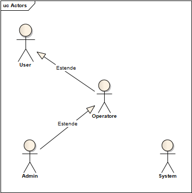
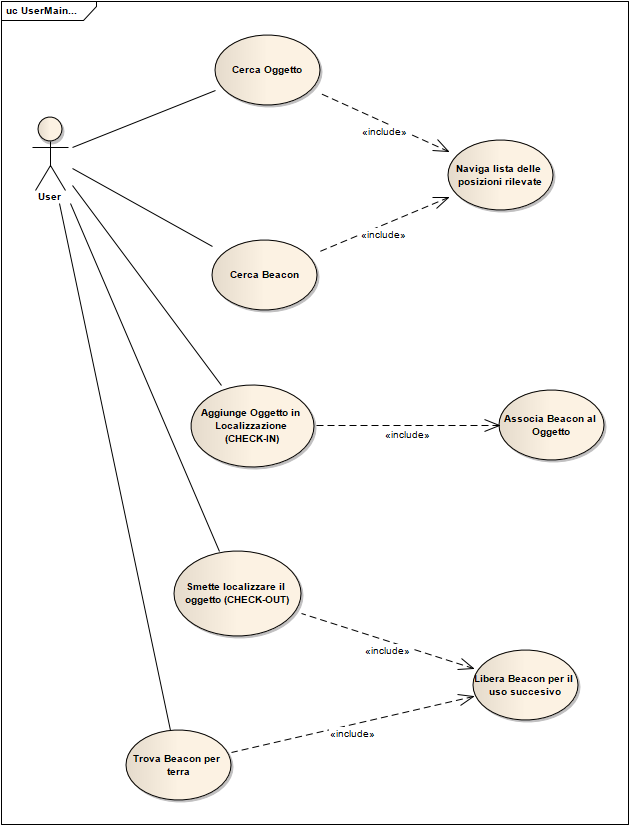
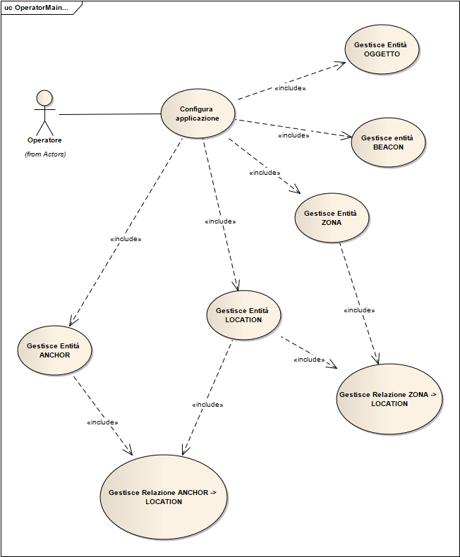
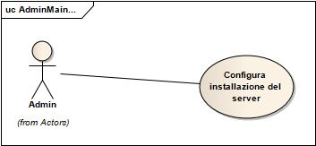
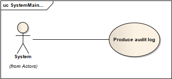

<h1> Indice</h1>

<!-- TOC -->

- [1. Obiettivi](#1-obiettivi)
- [2. Acronimi – abbreviazioni](#2-acronimi-–-abbreviazioni)
- [3. Allegati/Riferimenti](#3-allegatiriferimenti)
- [4. Descrizione della fornitura](#4-descrizione-della-fornitura)
    - [4.1 Oggetto della fornitura](#41-oggetto-della-fornitura)
    - [4.3 Esclusione della fornitura](#43-esclusione-della-fornitura)
    - [4.4 Requisiti non funzionali](#44-requisiti-non-funzionali)
- [5. Architettura del software e del sistema](#5-architettura-del-software-e-del-sistema)
    - [5.1 Specifiche funzionali](#51-specifiche-funzionali)
        - [5.1.1 Attori](#511-attori)
        - [5.1.2 Casi d'uso](#512-casi-duso)
        - [5.1.3 Entità e relazioni](#513-entità-e-relazioni)
        - [5.1.4 Interfaccia utente](#514-interfaccia-utente)
- [6. Architettura del sistema PER SVILUPPO E DEPLOY](#6-architettura-del-sistema-per-sviluppo-e-deploy)
- [7. Piano delle attività](#7-piano-delle-attività)
    - [7.1 Personale del fornitore](#71-personale-del-fornitore)
- [8. Collaudo](#8-collaudo)

<!-- /TOC -->

# 1. Obiettivi

# 2. Acronimi – abbreviazioni
Acronimo | Definizione
------- | -------
SW|Software, programma / applicazione
HW | Hardware computer fisico installato a bordo macchina o altre parti eletroniche.
ZONELOC | Localizzazione zonale
[ORM](https://it.wikipedia.org/wiki/Object-relational_mapping) | Object relational mapper
[XAML](https://it.wikipedia.org/wiki/XAML) | estensione (nome di fatto) dei file per fare strato view nelle applicazioni C# WPF
[CI/CD](https://en.wikipedia.org/wiki/CI/CD) | Sistema per il build automatico con i aggiornamenti in produzione automatici
[Git](https://it.wikipedia.org/wiki/Git_(software)) | Sistema per la gestione di sorgenti del SW
[GitFlow](https://www.atlassian.com/git/tutorials/comparing-workflows/gitflow-workflow) | Workflow per uso del Git
[UI](https://it.wikipedia.org/wiki/Interfaccia_utente) | Interfaccio del utente (maschere)  

# 3. Allegati/Riferimenti

Allegato | Riferimento
---------|----------
 [Localizzazione_UserStory_v0.1.pdf](attach/Localizzazione_UserStory_v0.1.pdf)  | Localizzazione_UserStory_v0.1.pdf

# 4. Descrizione della fornitura

## 4.1 Oggetto della fornitura
Soluzione software (SW) per la localizzazione zonale dei stabilimenti. (da finire)

## 4.3 Esclusione della fornitura

## 4.4 Requisiti non funzionali
In seguito verranno riportati i vincoli strutturali per la soluzione. Corretta procedure di aggiornamento e necessario che esista un clone del ambiente per fare i test prima di installare le eventuali modifiche in produzione.
- Requisiti minimi HW del server
    - (da finire)
- Requisiti SW 
    - (da finire)
  
*Eventuali vincoli di affidabilità o tempistica di intervento in caso di malfunzionamenti non sono oggetto di questo documento.*

# 5. Architettura del software e del sistema
SW sarà realizzato come "Single Page Application"

## 5.1 Specifiche funzionali

SW dovrà funzionare in ambiente industriale sui PC dei magazzini e sui tablet industriali nei vari stabilimenti
  

### 5.1.1 Attori
SW sarà utilizzato da 4 diverse tipologie di utenti. Per poter gestire la macchina utenti dovranno identificarsi con Login e password. Login del utente rimane valido per tempo limitato. Se utente non effettua nessuna operazione verrà automaticamente *disconnesso entro 5* minuti. Il timer si riavvia ogni operazione fatta.

1. **User** - utente base spesso operatore della officina, questo utente ha poteri molto limitati
2. **Operatore** - primo livello della utenza specializzata, addetto alle configurazioni.
2. **Admin** - utente con poteri assoluti.
4. **System** - SW stesso.

### 5.1.2 Casi d'uso

1. **User** fa cerca Oggetto o Materiale tramite ZONELOC

2. Casi d'uso principali del **Operatore**

3. Casi d'uso del **Admin**

4. Casi d'uso di **System**

### 5.1.3 Entità e relazioni

1. Material

### 5.1.4 Interfaccia utente

# 6. Architettura del sistema PER SVILUPPO E DEPLOY
- **Sviluppo** Per sviluppare la soluzione utilizzeremo Visual Studio Code 
- **Gestione sorgenti** Par la gestione e condivisione dei sorgenti utilizzeremo Git con appoggio a GitLAB come repository centrale. Come workflow di lavoro utilizziamo GitFlow
- **Deploy** SW sarà installato sulle macchine fisiche in produzione industriale. In tali condizioni non si può prevedere utilizzo [CI/CD](https://en.wikipedia.org/wiki/CI/CD), ma SW sarà sempre installato e testato a bordo macchina da un personale particolarmente addestrato. Per sviluppare la soluzione seguiremo rigorosamente tecniche di [Test driven development](https://it.wikipedia.org/wiki/Test_driven_development). In questa maniera ogni nuova release deve superare una batteria di regression test e solo successivamente può essere rilasciata in forma di pacchetto di installazione. 

# 7. Piano delle attività

## 7.1 Personale del fornitore

Stoorm5 metterà a disposizione questo team per poter realizzare soluzione.
- Account manager, (da finire)
- Coordinatore Sviluppi,  programmatore e analista dei sistemi e integrazioni 
- Sviluppo, programatori Angular e SQL
- Grafica UI, grafico specializzato in CG

# 8. Collaudo
Verrà stillato un **checklist** per ciascuna parte del software. **Cliente sarà incaricato** a verificare tutti punti del **checklist** per collaudare la soluzione.

